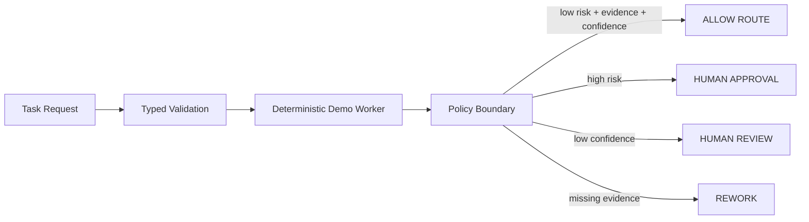

# Enterprise AI Agent Production Starter — Lite Edition

A small, runnable reference project for one of the hardest transitions in agentic AI: moving from a demo that can reason to a system that has explicit **state, policy, approval and validation boundaries**.

This free Lite Edition is intentionally narrow. It is designed to be cloned, understood in under an hour, and used as a starting point for technical discussion—not as a finished production platform.

> **Want the complete implementation system?** The full **Enterprise AI Multi-Agent Architecture Blueprint — 2026 Complete Implementation Kit** adds the complete reference repository, 11 automated tests, 18-control security audit, acceptance/risk systems, commercial pricing workbook, consulting/delivery templates and workspace assets.
>
> **Full kit:** https://whop.com/drdemon/enterprise-ai-blueprint/

## The production problem this repo demonstrates

A model saying “I am confident” should never be the same thing as your system saying “this action is authorized.”

This starter separates those concerns:



The `ALLOW` result in this repo is a **routing label only**. There is deliberately no endpoint that performs an irreversible external side effect.

## What you get in the free Lite Edition

- FastAPI validation endpoint
- Typed Pydantic request/state/decision contracts
- Deterministic worker so no API key is required
- Policy gate kept outside the model
- Human-approval route for high-risk work
- Evidence and confidence checks
- 5 automated tests
- 5-control production security checklist
- One architecture pattern and extension notes
- GitHub Actions test workflow

## Quick start

```bash
python -m venv .venv
source .venv/bin/activate  # Windows: .venv\Scripts\activate
pip install -e .[dev]
uvicorn agent_production_lite.app:app --reload
```

In another terminal:

```bash
curl -X POST http://127.0.0.1:8000/v1/tasks/validate \
  -H 'Content-Type: application/json' \
  -d '{"task_id":"demo-1","input_data":"Validate Invoice 1234 for Acme Corp","risk_level":"LOW"}'
```

Run tests:

```bash
pytest -q
```

## Example decisions

A normal low-risk request with evidence can return:

```json
{
  "route": "ALLOW",
  "reason": "policy_checks_passed"
}
```

A high-risk request returns:

```json
{
  "route": "HUMAN_APPROVAL",
  "reason": "high_risk_action"
}
```

A vague/low-confidence request returns `HUMAN_REVIEW`, and a completed task without required evidence returns `REWORK`.

## Repository map

```text
src/agent_production_lite/
  app.py        FastAPI boundary
  models.py     Typed contracts
  worker.py     Deterministic demo worker
  policy.py     Policy gate outside the model
  service.py    Orchestration service

tests/
  test_policy.py
  test_api.py

docs/
  architecture.md
  security_checklist.md
```

## Lite vs Complete Implementation Kit

| Capability | Free Lite | Complete Kit |
|---|---:|---:|
| Runnable reference | ✓ narrow starter | ✓ complete reference starter |
| Automated tests | 5 | 11 |
| Security controls | 5 introductory controls | 18-control zero-trust audit |
| Architecture coverage | 1 pattern | multi-pattern architecture blueprint |
| Acceptance framework | — | 10 starter acceptance tests + P0 blockers |
| Risk scenarios | — | 8 seeded scenarios |
| Commercial pricing model | — | 6-sheet workbook |
| Client delivery / consulting templates | — | included |
| Offline workspace pack | — | included |

**Complete kit:** https://whop.com/drdemon/enterprise-ai-blueprint/

## What this repo intentionally does not do

It does not provide production SSO, durable workflow state, tenant isolation, KMS-backed identity, production rate limits, real write-capable tools, database migrations or deployment-specific observability.

Those omissions are deliberate. A tiny public demo should not pretend that mock controls are production security.

## Who this is for

AI engineers, technical founders, solution architects, consultants and agencies building agentic workflows that need clearer boundaries around model output, approvals and downstream actions.

## License

MIT for this Lite Edition. See `LICENSE`.

The commercial Complete Implementation Kit is separately licensed and is not included in this repository.
