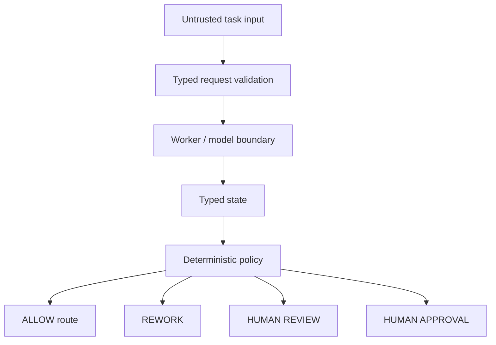

# Architecture Note: Confidence Is Not Authority

The central pattern in this Lite Edition is separation between **model/worker output** and **system authority**.

## Why this matters

A model can estimate confidence, classify intent or propose an action. It should not grant itself permission to perform a material side effect.

A production design normally needs additional boundaries for:

- authenticated service/user identity
- authorization and resource scope
- durable state/checkpointing
- idempotency for retries
- approval verification
- audit logging
- tool input/output validation
- budget/rate controls
- rollback/compensation

This public repo demonstrates only the first architectural separation. The commercial implementation kit expands this into a broader architecture, security, testing and delivery system.

Complete kit: https://whop.com/drdemon/enterprise-ai-blueprint/
