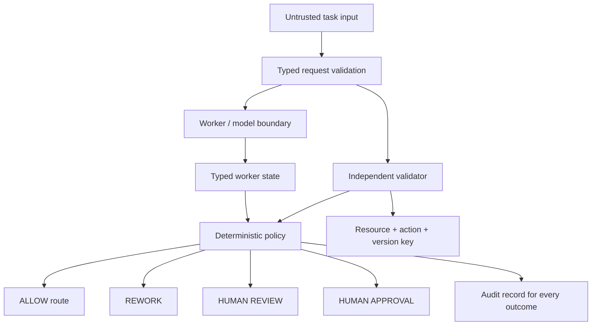

# Architecture Note: Judgment Is Not Authority

The central pattern in this Lite Edition is separation between **model/worker output** and **system authority**.

Version 0.2 adds two more boundaries that came directly from production-oriented feedback: an independent validator and a resource-scoped replay key.

```mermaid
flowchart TD
    U[Untrusted task input] --> V[Typed request validation]
    V --> W[Worker / model boundary]
    V --> X[Independent validator]
    W --> S[Typed worker state]
    X --> P[Deterministic policy]
    S --> P
    P --> A[ALLOW route]
    P --> R[REWORK]
    P --> H[HUMAN REVIEW]
    P --> G[HUMAN APPROVAL]
    X --> K[Resource + action + version key]
    P --> L[Audit record for every outcome]
```

## Why this matters

A model can estimate confidence, classify intent or propose an action. It should not grant itself permission to perform a material side effect.

The same principle applies to context. If a model can freely rewrite the target resource, action or scope that the policy layer later reads, the policy boundary is weaker than it appears. This Lite starter therefore keeps independent validation separate from worker self-confidence and generates its replay key from a resolved resource, action and operation version.

## What v0.2 demonstrates

- model self-confidence is visible but not authoritative
- independent validation can trigger review
- high-risk work routes to human approval
- missing evidence routes to rework
- resource-scoped idempotency keys remain stable across task retries
- every decision, including ALLOW, is added to an audit trail

The audit storage is intentionally in-memory and the idempotency key is not enforced against a distributed durable store. Those are production concerns, not claims made by this demo.

A real deployment normally needs additional boundaries for:

- authenticated service/user identity
- authorization and resource scope
- durable state/checkpointing
- durable idempotency and concurrency control
- approval verification
- immutable audit logging
- tool input/output normalization
- budget/rate controls
- rollback/compensation

The commercial implementation kit expands this into a broader architecture, security, testing and delivery system.

Complete kit: https://whop.com/drdemon/enterprise-ai-blueprint/
